<<<<<<< HEAD
## RoboMasters Robotics Competition

## Sentry Vision-Based Target Tracking

## Project Overview

RoboMasters 是一项全新的机器人超级对抗赛。参赛队伍通过自行设计制造多种机器人进行射击对抗，完成指定任务，由比赛裁判系统判定比赛胜负。


参赛机器人包括可以发射“弹丸”的手动机器人以及能够完成一定任务的自动机器人。参赛队员需要遥控手动机器人在复杂的场地中移动并发射“弹丸”，攻击对方机器人和基地以取得胜利。自动机器人将在比赛中自动完成指定任务。

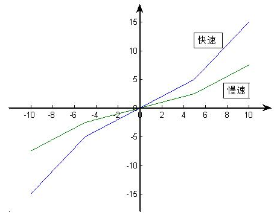

比赛采用红、蓝双方对抗的形式，每场限时 5 分钟。我们负责的部分就是通过识别红、蓝两种颜色进行目标识别与追踪。

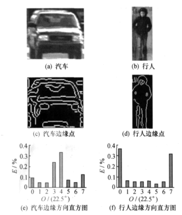

## Project Goals

## Basic Functionality and Performance

本项目的基本功能是在操作手下达瞄准指令后，可以在较短时间内通过摄像头捕捉的图像发现目标，并自动控制二轴云台对目标进行瞄准。基本功能只要求对静止或者以较低速度运动的目标进行瞄准，所以在程序的性能方面没有十分严苛的要求。

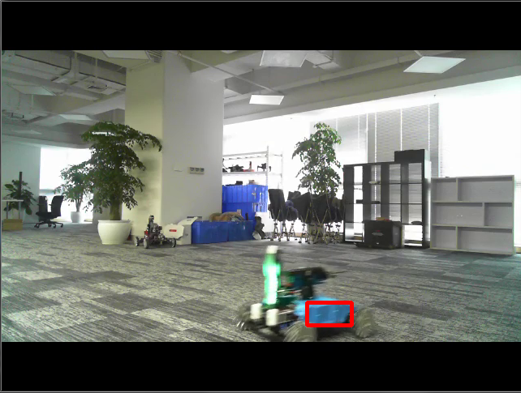

## 扩展功能和性能

扩展功能要求能够在我方机器人和对方机器人都处在运动的条件下，对视野内的目标实现时事追踪。即在没有人工干预的情况下，由二轴云台控制的“炮管”要一直瞄准敌方机器人。

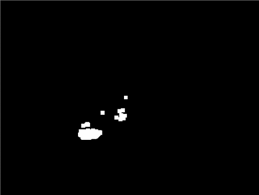

要达到扩展功能的目标，我们初步估算的性能要求是帧数达到20至30帧每秒，即处理每帧图像的处理的时间不能超过50ms。此外，控制云台瞄准目标的过程中，不能产生过度的晃动，在目标附近来回摆动不应该超过3次。

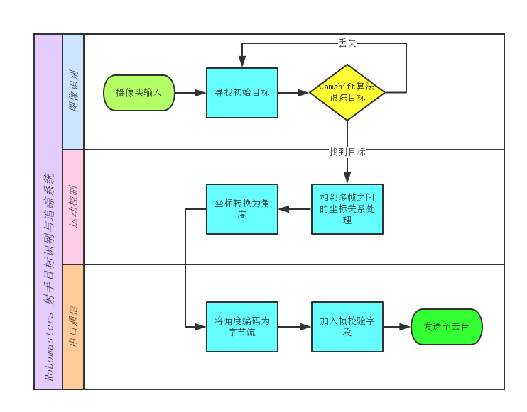

## 系统设计方案

## 系统框图

系统由3个部分组成：图像识别模块、运动控制模块、通信模块。

由图像识别模块识别目标，并以图像中心为原点（假设中心为着弹点），将目标的坐标作为输入传递给运动控制模块；运动控制模块的主要任务是将坐标转换为云台需要转过的相对角度，并且要减少云台在目标附近的摆动；运动控制模块得到的角度作为下一级串口通信模块的输入，后者对角度进行编码得到相应的字节流，以多个字节为一帧并加入帧校验字节。最终，数据通过串口传递给云台主控板。

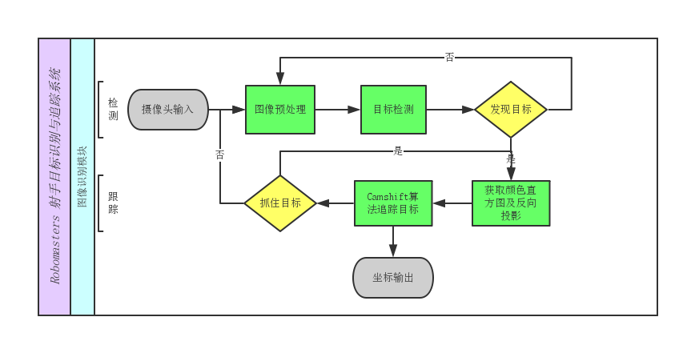

## 子系统框图

## 图像识别

图像识别模块实现两个功能：检测和跟踪。

检测的目的是在程序首次运行或者跟踪失败的时候能够重新找回目标，一旦在视野中检测到了目标的存在，就进入跟踪模块。此后，检测模块不会再介入到跟踪模块的运行直到跟踪失败。

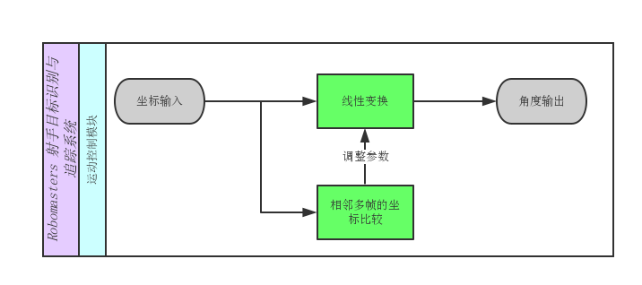

## 运动控制

运动控制模块通过线性函数将坐标转换为角度，经过多次调试找到了较为合适的函数参数。除了简单的线性变换外，该模块还需要判断是否已经锁定目标、解决由于机械原因带来的云台卡住的问题等。

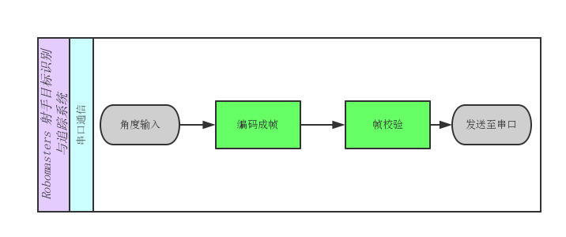

## 串口通信

该模块除了要将float类型的角度编码为字节流以外，还应该加上帧校验字节，以免数据传输的过程中出现错误导致云台工作不正常。

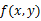

## 方案比较

在系统设计过程中，主要有两种方案：检测与跟踪相结合，即在找到目标之后调用Camshift算法进行跟踪；使用检测代替跟踪，即完全使用检测的方法，将每一帧视为独立的（或关联性较弱）图像进行颜色识别，找到目标。

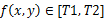

最初由官方提供的开源资料中，使用的就是第二种方法。它假设这一帧中目标的位置应该距离上一帧目标位置最近，除此之外每一帧之间没有联系。这种方法在构建连通域的时候时间复杂度达到了O(n2)，当视野中出现的目标颜色较多的时候处理速度较慢。

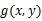

检测与跟踪相结合的方案中，我们使用Camshift算法进行目标跟踪。Camshift算法是一个半自动的颜色识别算法，所谓半自动就是它要求用户提供初始目标，目标丢失之后也不能再次找回。因此，我们将上面提到的检测算法与Camshift结合，初始目标和目标丢失之后的重新找回都由第一种方法自动提供。这一方案速度较快，测试时帧数可以达到25帧每秒。

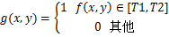

此外，我们还尝试了Camshift结合Kalman滤波的图像追踪算法，但是由于时间不足这一方案并没有得到较好的结果。

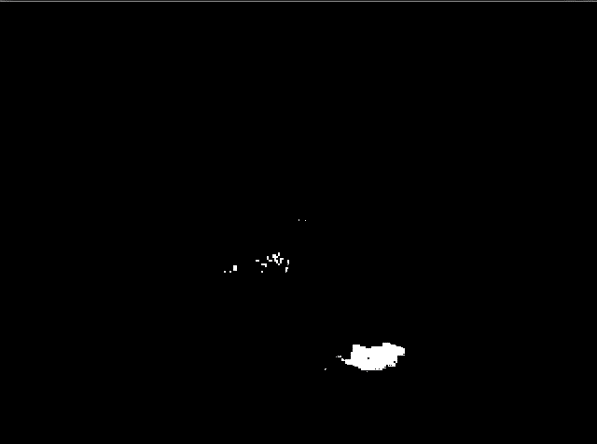

## 各模块工作原理

## Image Recognition Module

为了长时间跟踪目标，要求当目标被遮挡或离开视野后重新出现在视野中时，系统能够重新检测到它，并开始跟踪。所以，这里我们采用检测和跟踪两个模块相会配合实现图像识别模块。这里图像识别的基本原理是颜色识别。

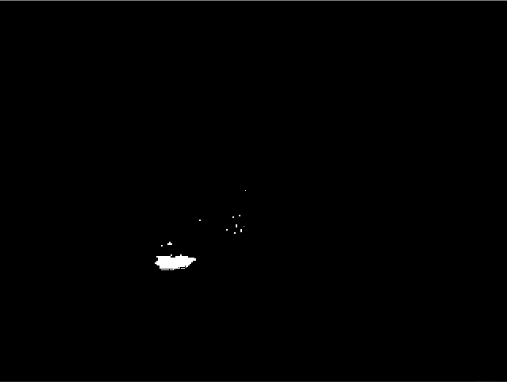

## 目标检测模块的原理

目标检测模块首先将输入的彩色图像进行色彩空间变换，对转换后的HSV图像中的Hue分量进行阈值分割得到二值图像，再通过形态学开运算和闭运算滤去噪声，最后找到目标。

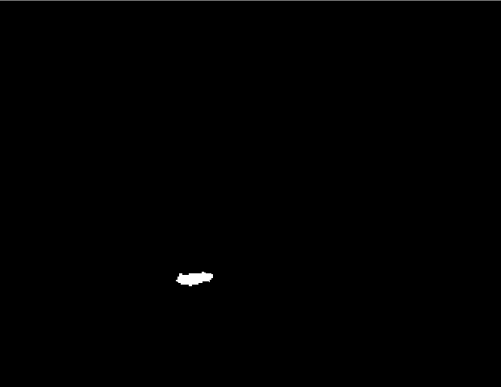

下面对这一过程所涉及到的原理进行详细说明。

## HSV色彩空间

由摄像头输入的图像为RGB格式，即每一帧图像都是一个M*N*3的数组，它们对应一幅彩色图像的红、绿、蓝3个分量。依据RGB的三原色的加色法，电视机、显示器、投影仪等设备可以在RGB色彩空间生成大量的不同颜色，然而这三种颜色分量的取值与它们所生成的颜色之间的联系并不是那么直观。因此从摄像头得到图像之后，我们的第一步处理就是将图像从RGB色彩空间转换到HSV色彩空间。

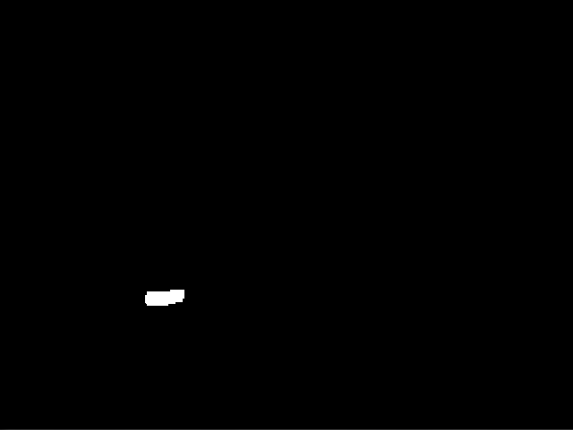

HSV即色相、饱和度、明度（英语：Hue, Saturation, Value）。色相是色彩的基本属性，就是我们平时常说的颜色，饱和度指色彩的纯度、明度指亮度。通过色彩空间的转换，我们将一个三维的矩阵降维，仅在H分量上通过事先输入的色彩直方图对图像进行分割。

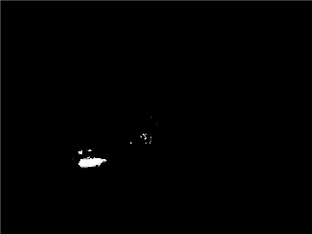

## 阈值分割

由于HSV色彩空间中，Hue分量包含了所有的颜色信息，我们选定一个阈值来分离图像中的某种特定的颜色。任何满足的点称为对象点，其他点称为背景点。也就是说，阈值处理后的图像定义为

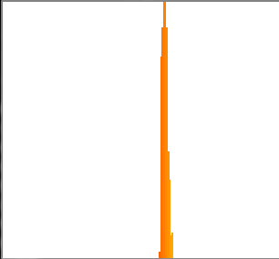

## 经过阈值处理后的图像为一个二值图像，如下图所示：

## 开运算和闭运算

膨胀和腐蚀运算是形态学图像处理的基础。膨胀是在二值图像中“加长”和“变粗”的操作，它使图像边界向外部扩张，可以用来填补物体中的空洞。如下图为膨胀的一个简单例子。

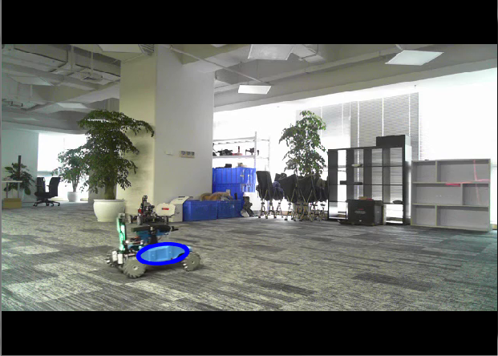

腐蚀“收缩”和“细化”二值图像中的对象。它可以消除边界点，使图像边界向内部收缩，可以用来消除小而无意义的对象。下图中（a）为原式图像，（b）、（c）、（d）为使用不同的掩膜对原图像腐蚀后的结果。

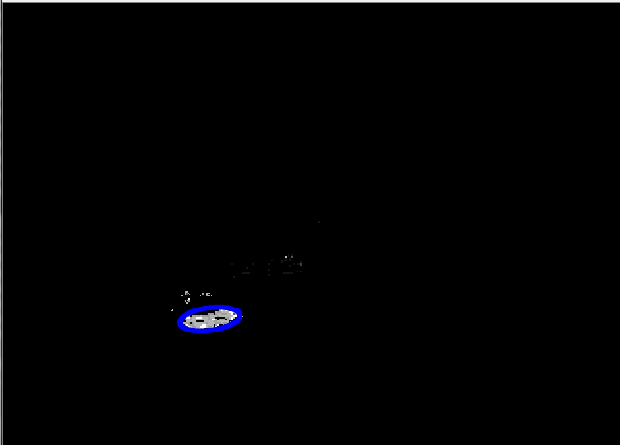

先腐蚀后膨胀的过程称为开运算。用来消除小物体、在纤细点处分离物体、平滑较大物体的边界的同时并不明显改变其面积。先膨胀后腐蚀的过程称为闭运算。用来填充物体内细小空洞、连接邻近物体、平滑其边界的同时并不明显改变其面积。

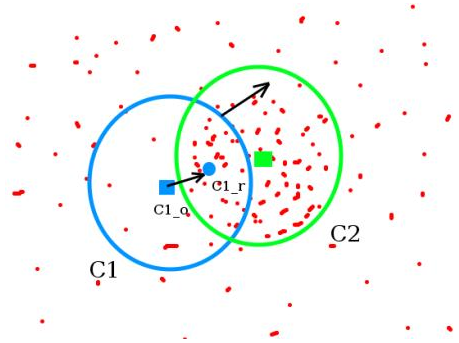

在上一步阈值分割得到二值图像后，我们先进行开运算再进行闭运算，消除小且无意义的点，并且填充内部细小的空洞。最终得到的二值图像如下。

可见，经过开运算和闭运算之后，二值图像中的噪声点被有效地去除了，同时图像内部的空洞也被填充，为下一步寻找图像轮廓做好了准备。

## 找到目标的轮廓矩形

由摄像头输入的彩色图像经过阈值分割、开运算以及闭运算的处理后得到了一个二值图像。在该二值图像上找到所有对象的外轮廓矩形并将相交的矩形合并，可以得到一个或多个矩形。最终我们以矩形的大小和距离上一次目标丢失的坐标点的距离为依据选择一个目标。

## 联通区域检测及合并的详细执行过程如下：

连通区域是对二值图像进行处理的，即该图像只有黑和白两种颜色，这里，假设目标为白色，背景为黑色。标记算法首先对二值图像进行一次完整的扫描，标记所有目标像素点的同时，得到并记录等价标记对。等价标记对 （以下简称等价对）的产生是由于扫描次序的不同，导致开始时认为是两个不同的连通区域，后来随着扫描的深入，又发现这两个区域是连通的。所以，需要记录等价对，以表明它们隶属于同一个连通区域，以便第一次扫描结束后进行修正。标记算法首先对二值图像的每一个像素进行8连通区域的标记，即:对任意一个像素的上、下、左、右、左上、右上、右下、左下，共8个相邻像素进行比较。由于不是每个像素都有8个相邻像素，对于一些特殊位置的像素点需要特殊考虑，其中包括：

（1）二值图像左上角的像素，由于是第一个要扫描的像素，无需进行8连通区域的检测，也无需考虑记录等价对的问题。

（2）二值图像第一行的像素，只需要考虑左边相邻像素的连通性，无需考虑记录等价对。

（3）二值图像第一列的像素，只需要考虑上和右上2个相邻像素的连通性。

（4）二值图像最后一列的像素，只需要考虑左、左上、上3个相邻像素的连通性。

除了以上4种情况，其它像素，都需要考虑其8个相邻像素的连通性，如果出现不同连通标记的相邻像素，还需要考虑记录等价对的问题。

## 连通算法中的二值图像扫描步骤归纳如下：

（1）标记图像左上角，即，第一行第一列的像素。如果其像素值为255，则标记该点的值为1，否则，开始扫描第一行第二列的像素。

（2）标记第一行的其它像素，此时，不会产生等价对的情况，不必考虑记录等价对。对该行的每一个像素，如果其值为255，检测左边像素是否为255，若是，则该点标记为左边像素点的标记；否则，该点的标记为前一个标记值加一；若该点的像素值为0，继续扫描下一个像素。

（3）对除了第一行以外的像素行进行标记，此时会出现等价对的情况，需要进行记录。

（3.1）首先对第一列进行处理，若该点像素值为0， 则扫描该行下一个像素，否则，检测上、右上两个像素位置的像素值。若上被标记过，该点标记为上像素点的标记值。这时，再看右上是否被标记过，若也被标记 过，比较上和右上的标记值是否相等，如果不相等，则记录上和右上为一个等价对，并将其记录在等价对记录表中。若上没有被标记，而右上被标记了，则该点标记 为右上的标记值。如果上和右上都没有被标记，该点的标记值为上一个标记值加一。

（3.2）对中间列进行处理，若该像素的像素值为255，则检测左、左上、上、右上位置的像素值。若上述四个位置的像素值都为0，则该点的标记值为上一个标记值加一。如果上述四个位置中只有一个的像素值为255，则该点就标记为那个像素点的标记值。如果其中有m（m大于1，小于等于4）个像素点的像素值为255，则按照左、左上、上、右上的优先顺序来确定该点的标记值，然后对这m个像素位置的标记值进行等价对的分析，并进行相应的记录。

（3.3）对最后一列进行处理，步骤同上。

（3.4）依次扫描，直到所有像素值都被扫描。

（4）对等价记录表中的所有等价对进行处理，得到最终的连通区域标记。

检测到联通区域后，还要根据连通区域之间的距离和颜色相似性，将距离接近且相似性高的连通区域进行合并。具体方法是计算两两矩形中心的欧式距离，若距离小于阈值我们则认为其是联通的，于是用一个新的大矩形将其包括，并再次参与新的计算，依次类推直至不能再合并。最后得到若干个连通合并后的矩形区域。但这些区域中只能有一个被当做敌方目标，所以要进行下一步的筛选。

在Opencv中有专门函数实现上述功能，使用起来非常方便。

## 跟踪模块原理

跟踪模块进行的第一步也是将输入的RGB图像转换为HSV图像，通过Hue分量和事先提供的颜色直方图得到目标可能出现的位置的概率分布图，即反向投影图。将反向投影作为Camshift算法的输入，得到目标位置坐标。

## 颜色直方图

颜色直方图反映的是图像的全局特征，它体现了图像的颜色分布。实际上，我们通过HSV色彩空间的Hue分量来获取颜色直方图。

OpenCV中Hue分量的取值范围为0到180。所以，在获取颜色直方图时,我们设置了180个“桶”进行计数，并归一化最大值为255，最后得到的直方图形式如右图。

## 反向投影

图像的反向投影图是用输入图像的某一位置上像素值（多维或灰度）对应在直方图的一个bin上的值来代替该像素值，所以我们可以近似地将反向投影图视为目标的概率分布图。

自然这里的输入图像指HSV颜色空间的Hue分量。下图为原式图像和反向投影，图中的蓝色圆圈为由Camshift算法找出的目标。

## Camshift算法

Camshift算法是Meanshift算法的改进版本，这里我先介绍Meanshift算法。

Meanshift算法思想并不复杂：利用概率密度的梯度爬升来寻找局部最优。它要做的就是输入一个在图像的范围，然后一直迭代（朝着重心迭代）直到满足要求为止。

考虑下面一幅图，图中的点的疏密代表概率，初始的时候我们有一个圆C1，它的圆心位于C1_o。首先，我们求得圆C1内的重心为C1_r，然后将圆心移动到C1_r，再重新计算重心。大多数时候圆心和重心之间是存在一定误差的，通过多次迭代最终我们使圆心与重心重合（或者在给定的误差范围之内），最终得到圆如C2所示。C2就是局部最优解。

那么，我们如何使用Meanshift进行图像追踪呢？这要求我们提供的概率分布图为摄像头输入图像的反向投影图。如上一节所说，反向投影图可以简单的视为目标的概率分布图，初始的搜索窗C1由目标检测模块提供。当目标运动时，反向投影图中的重心跟着运动，Meanshift算法通过向重心迭代找到的局部最优解就是我们所需要的目标。

但是这里仍然有一个问题，在Meanshift算法中搜索窗的大小不会变化，当目标与摄像机之间的相对距离发生变化时，目标在图像中的大小却是会改变的。这就是Camshift（Continuously Adaptive Meanshift）对Meanshift的改进：将所有帧做Meanshift运算，并将上一帧的结果，即搜索窗的大小和中心作为下一帧Meanshift算法搜索窗的初值。如此迭代下去，就可以实现对目标的连续跟踪。

## Motion Control Module

运动控制模块的主要功能是将输入的坐标转换为云台须要转动的相对角度信息，主要的问题是克服云台在目标附近摆动，加快稳定速度，同时云台转动要足够迅速。为了解决这一问题，我们主要采取了两个措施：使用分段的线性函数进行坐标变换；提供快速和慢速两种工作模式。

如下图所示，x轴为输入坐标值，y轴为角度。当目标距离图像中心较近时，云台转动速度减慢，有利于云台的稳定；当目标较远时，快速转动，加快锁定目标的速度。当云台开始出现摆动现象时进入慢速模式。

这里使用简单的分段线性函数而不采用拟合度更高的非线性函数（如指数函数）的原因是，线性函数的参数调整更加方便，便于不断通过测试进行调优。

## Serial Communication Module

该模块将float类型的角度编码为帧，并通过串口发送至云台主控。float类型数据最终须要存储到uchar类型的数组中，这一转换由如下语句完成。

```cpp
unsigned char *x1=(unsigned char*)&nHangle;
```

## tmpchar[0] = *(x1);

## 系统测试及调试

系统测试及调试的过程中遇到了许多的问题，这里我主要讨论颜色识别和运动控制两个方面分别遇到的主要问题以及它们的解决方案。

## 实现全自动追踪

不管是Meanshift还是Camshift，都需要一个初始的搜索窗以及颜色直方图，这个搜索窗一般由用户在程序开始运行时使用鼠标框出，程序自动计算该搜索窗的颜色直方图。因此，Camshift只能进行半自动的追踪。但是，本项目要求机器人上电后就开始自动搜索并追踪目标。

解决这个问题的方案如前面原理部分所说，我们将颜色识别模块分为检测和追踪两个部分，检测部分采用简单的阈值分割、形态学运算等方法处理后找到一个最合适的搜索窗作为初始搜索窗。这里“最合适”的定义也根据实际情况改变了多次。

最开始我们选择轮廓最大的目标作为初始搜索窗，但实际测试的过程中我们发现在目标偶然丢失时（由于运动、光线等原因丢失但实际上并没有出视野）可能导致算法重新选择其他目标追踪，使云台突然出现大幅度摆动而不稳定。为此，我们重新设计了选择算法，使目标检测模块输出的初始搜索窗为离上一次目标丢失点最近的目标。伪代码如下：

## 目标丢失，进入目标检测模块

生成一个以上一次目标坐标加上预估的提前量为中心，边长较小的矩形作为掩膜

## 图像和掩膜相与，即只保留掩膜内的图像，其他部分清零

## 从处理后的图像中寻找目标（按照4.1节介绍的方法）

若未找到目标，将掩膜边长乘以一个大于1的系数使搜索范围增大，重新回到3

## 找到目标，输出初始搜索窗，离开目标检测模块

这一方法的特点在于掩膜使搜索范围逐步增大，确保稳定性的同时提高了运算速度。此外，颜色直方图由我们提前采集并保存在文件中，上电后自动调用即可。

## 克服云台摆动不收敛

云台的稳定性和转动速度是一对矛盾的关系，特别是在云台参数本身不够完善的情况下。

由于系统是具有反馈机制的，即不管是转动没有到达目标或者超过了目标，下一帧都能够捕捉到并且重新给出一个角度，我们并不须要知道坐标对应的实际最佳角度应该是多少。所以联调初期，我们只是简单地将坐标乘上一个系数得到需要的角度值。当这个系数过小时，云台转动缓慢，达不到性能要求；反之系数较大，云台在目标附近来回摆动，出现周期性的震荡。

为此，我们使用4.2节所介绍的方案，当云台指向在目标附近时系数较小，反之系数大加快摆动速度。其次我们采用两档速度模式，进入低速模式的判断依据是在图像上目标第一次通过原点。低速模式的设计实践证明是非常有效的，最终云台稳定的速度达到了预期目标，实现了对运动目标的追踪。

## 项目实施总结及心得体会

在实验室环境下，项目从算法实现到软硬件联调都取得了不错的效果，但是在真实比赛的条件下却由于环境干扰没有发挥出它应有的作用。所以，这里我主要反思一下我的失误以及接下来应该如何改进。

## 总结反思

由于长期在理想条件下进行实验，我们忽略了颜色识别算法的抗干扰能力有限这一问题。最直接的体现是，在项目后期我们主要的工作都放在了运动控制方面，也就是和云台的联调，而颜色识别模块没有更多的优化。

在实验室无干扰或干扰较小的条件下，颜色识别算法表现出色，即使被其他物体所干扰而丢失目标也可以马上人工修正。但是，在比赛环境下电子屏幕、广告牌等事先没有预料到的干扰源使算法几乎无法正常工作。其次，操作机器人的操作手无法感知到程序的工作状态，自然无法进行人工修正。因此，我们必须在现有方案上进行改进。

## 改进方案

我认为，我们改进的方向应该是不以颜色为寻找目标的依据，颜色只作为辅助识别以及判断敌我的工具。

目前，我找到的改进方案有2种：改进的Camshift/Kalman运动目标跟踪算法、TLD跟踪算法。下面是对他们的介绍。

## 改进的Camshift/Kalman运动目标跟踪算法

Camshift仅根据目标的色彩信息建立目标的颜色直方图进行跟踪，因此它易受到颜色相近的干扰物影响，当光照变换时目标往往会跟丢。为了应对这种颜色缺陷，一种简单而快速的表示方法：边缘方向直方图（edge orientation histograms）被提出来，它能够有效应对光照变化和背景颜色变化的混淆，特别适合这种场合下的跟踪。

## 边沿方向直方图

边缘方向直方图 , 是对目标物体中边缘点的边缘方向一种分布统计，可以被用来描述表达目标物体。它已经被证明具有快速运算和鲁棒的特点。下图为一个边沿方向直方图的例子。

## Kalman滤波

Kalman滤波可以对运动目标的位置和角度进行估计，估计值可以用于提高跟踪速度、计算新的边缘方向特征等。

## 方案执行计划

除上面提到的边沿方向直方图，还可以考虑同时检测多种特征同时对目标建模，并对多特征信息的融合系数进行更新，从而形成一种基于Camshift的多特征自适应目标追踪算法。配合Kalman滤波，尝试是否会有更好的效果。目前该改进方案所须要做的工作如下：

## 查找论文、资料等信息

## 根据资料实现特征提取

## 对提取的特征恰当地融合，其中的系数须要通过试验确定

## 测试算法的实际效果

该方案的优势在于，Camshift是一种成熟稳定的算法，并且我们对它的原理、使用方法也有了较为全面的了解，如果能够实现提前除颜色之外的其他特征进行融合，该方案的实现难道较小。工作重点应该在特征提取以及自适应融合，特征提取时可以采用多线程的方式充分利用计算机性能。

## TLD跟踪算法

TLD(Tracking-Learning-Detection)是英国萨里大学的一个捷克籍博士生在其攻读博士学位期间提出的一种新的单目标长时间（long term tracking）跟踪算法。该算法与传统跟踪算法的显著区别在于将传统的跟踪算法和传统的检测算法相结合来解决被跟踪目标在被跟踪过程中发生的形变、部分遮挡等问题。同时，通过一种改进的在线学习机制不断更新跟踪模块的“显著特征点”和检测模块的目标模型及相关参数，从而使得跟踪效果更加稳定、鲁棒、

可靠。

## 方案执行计划

该算法由三部分组成：跟踪模块、检测模块、学习模块。与我们之前使用的Camshift不同，TLD算法需要一个机器学习的过程，只不过它是一个在线学习算法。

该方案的优势在于它有Matlab版和C++版的开源实现，目前已经下载并编译了C++版源代码，测试效果较为理想；其次它提供了较多的参数可供调整。其劣势在于，我们对该算法的了解太少，还不知道如何修改它为己用。接下来的计划如下：

## 结合资料阅读源代码

按照我们的项目要求对源代码进行修改，或者与之前的Camshift结合

## 实际测试

## 参考文献

Rafael, C, Gonzalez, /, Richard, E, Woods. 数字图像处理[M]. 北京:电子工业出版社, 2003.

OpenCV. Meanshift and Camshift[EB/OL]. docs.opencv.org.

刘士荣, 姜晓艳. 一种改进的Camshift/Kalman运动目标跟踪算法[J]. 控制工程, 2010, 17(04): 470-474

刘惟锦, 章毓晋. 基于 Kalman 滤波和边缘直方图的实时目标跟踪[J]. 清华大学学报 ( 自然科学版 ), 2008, 48(7): 1104-1107

云霄, 肖刚. 基于 Camshift 的多特征自适应融合船舶跟踪算法[J]. 光电工程, 2011, 38(5): 52-58

《基于递归的二值图像连通区域像素标记算法》，徐正光、鲍东来、张利欣，计算机工程，2006年

## 附录

## 源代码

/**********************camshif.cpp***********************/

```cpp
#include "opencv2/video/tracking.hpp"
```

```cpp
#include "opencv2/imgproc/imgproc.hpp"
```

```cpp
#include "opencv2/highgui/highgui.hpp"
```

## #include "Tracking.h"

## #include "MyComClass.h"

## #include <windows.h>

## #include <iostream>

## #include <ctype.h>

## #include <cstdint>

## #include <math.h>

## #include <process.h>

## using namespace cv;

## using namespace std;

## #define T_RED_A     5

## #define T_RED_B     170

## #define T_BLUE_LOW     100

## #define T_BLUE_HIGH     110

## #define HIST_IMG_ROWS  200

```cpp
#define MIN_VAL 50			//通过直方图获取目标的阈值
```

```cpp
#define WAIT_TIME 3			//等待摄像头打开的最大时间（s）
```

## /* 用于设置输出信息的变量 */

```cpp
bool showFPS = false;			//是否显示帧数
```

```cpp
bool selectRed = false;			//是否自动选择红色
```

```cpp
bool backprojMode = false;		//表示是否要进入反向投影模式，ture表示准备进入反向投影模式
```

```cpp
bool showHist = true;			//是否显示直方图
```

```cpp
volatile unsigned long changeTarget = 0;		//是否改变目标
```

```cpp
volatile unsigned long changeColor = 0;
```

## bool autoShoot = false;

## /* 状态变量 */

```cpp
bool selectObject = false;		//代表是否在选要跟踪的初始目标，true表示正在用鼠标选择
```

```cpp
int camshiftWorking = 0;		//非0时 由camshift追踪目标
```

```cpp
volatile long resetCamshift = 0;
```

```cpp
Point origin;			//用于保存鼠标选择第一次单击时点的位置
```

```cpp
Rect selection;			//用于保存鼠标选择的矩形框
```

## Mat image;				//摄像头得到的图像

## Mat hist;				//hue 的直方图

```cpp
RotatedRect trackBox;	//追踪到的目标
```

## RotatedRect preBox;

## bool paused = false;

## int width = 640;

## int height = 480;

## float boundW = 52;

## float boundH = 45;

## int centerX = 320;

## int centerY = 300;

Rect_<float> centerBound(centerX-boundW/2.0f, centerY-boundH/2.0f,

## boundW, boundH);

```cpp
int vmin = 50, vmax = 256, smin = 110;
```

## PortOperate *myPort;

## Tracker *tracker;

## float autoKw = 1;

## float autoKh = 1;

## void saveSettings()

## {

```cpp
FileStorage fs("C:\\robomasters\\settings.xml", FileStorage::WRITE);
```

## fs << "width" << width;

## fs << "height" << height;

## fs << "centerX" << centerX;

## fs << "centerY" << centerY;

```cpp
fs << "selectRed" << selectRed;
```

## fs << "vmin" << vmin;

## fs << "vmax" << vmax;

## fs << "smin" << smin;

## fs.release();

```cpp
cout << "save settings successfully" << endl;
```

```cpp
cout << "width:" << width << "; height:" << height << "; centerX:"
```

```cpp
<< centerX << "; centerY:" << centerY << "; selectRed:" << selectRed << endl;
```

## }

## bool loadSettings()

## {

```cpp
FileStorage fs("D:\\robomasters\\settings.xml", FileStorage::READ);
```

## int w, h;

## fs["width"] >> w;

## fs["height"] >> h;

## if (w == 0 || h == 0)

## {

```cpp
cout << "load settings failed" << endl;
```

## return false;

## }

## width = w;

## height = h;

## fs["vmin"] >> vmin;

## fs["vmax"] >> vmax;

## fs["smin"] >> smin;

## fs["centerX"] >> centerX;

## fs["centerY"] >> centerY;

## fs["selectRed"] >> selectRed;

## //selectRed = 0;

## fs.release();

```cpp
tracker->setParameters(width, height, centerX, centerY, boundW, boundH);
```

## tracker->clearPre();

```cpp
centerBound.x = centerX-boundW/2.0f;
```

```cpp
centerBound.y = centerY-boundH/2.0f;
```

## centerBound.width = boundW;

## centerBound.height = boundH;

```cpp
cout << "load setting successfully" << endl;
```

```cpp
cout << "width:" << width << "; height:" << height << "; centerX:"
```

```cpp
<< centerX << "; centerY:" << centerY << "; selectRed:" << selectRed << endl;
```

```cpp
cout << "vmin:" << vmin << "; vmax:" << vmax << "; smin:" << smin << endl;
```

## return true;

## }

bool saveHist(const char * filename = "C:\\robomasters\\hist.xml")

## {

if (hist.rows <= 0 || hist.cols <= 0)

## {

```cpp
cout << "save hist faided" << endl;
```

## return false;

## }

```cpp
FileStorage fs(filename, FileStorage::WRITE);
```

## fs << "hist" << hist;

## fs.release();

```cpp
cout << "save hist successfully" << endl;
```

## return true;

## }

bool loadHist(const char * filename = "C:\\robomasters\\hist.xml")

## {

```cpp
FileStorage fs(filename, FileStorage::READ);
```

## fs["hist"] >> hist;

if(hist.rows <= 0 || hist.cols <= 0)

## {

```cpp
cout << "load hist failed" << endl;
```

## return false;

## }

```cpp
normalize(hist, hist, 0, 255, CV_MINMAX);
```

```cpp
cout << "load hist successfully" << endl;
```

## return true;

## }

void plotHist(Mat &histimg, int hsize)

## {

## //绘制直方图

## histimg = Scalar::all(0);

```cpp
float binW = (float)histimg.size().width / hsize;
```

```cpp
for( int i = 0; i < hsize; i++ )
```

## {

```cpp
Vec3b color = Vec3b(saturate_cast<uchar>(i*180./hsize), 255, 255);
```

```cpp
int val = static_cast<int>(hist.at<float>(i));	//at函数为返回一个指定数组元素的参考值
```

rectangle( histimg, Point(static_cast<int>(i*binW), histimg.size().height),

Point(static_cast<int>((i+1)*binW), histimg.rows - val),

## Scalar(color), -1, 8 );

## }

```cpp
cvtColor(histimg, histimg, CV_HSV2BGR);//将hsv又转换成bgr
```

## }

## /* 清除当前追踪的目标 */

## void clearTrack()

## {

```cpp
InterlockedExchange(&resetCamshift, 1);
```

## //hist = Mat();

## }

bool isLegalRect(float w, float h)

## {

## if(w <= 5 || h <= 3) {

## return false;

## }

## return true;

## float fHW = h / w;

```cpp
return w*h > 10 && (fHW > 1.34 || fHW < 0.7);
```

## }

## int tracking()

## {

```cpp
float boxW = trackBox.boundingRect().width;
```

```cpp
float boxH = trackBox.boundingRect().height;
```

if(!camshiftWorking || !isLegalRect(boxW, boxH))

## {

## tracker->clearPre();

```cpp
//cout << "tracking failded:" << camshiftWorking << "," << boxW << "," << boxH << endl;
```

## return 0;

## }

```cpp
float r = MIN(boxW, boxH) / 2.0f;
```

```cpp
r = r < 20 ? 20 :(r > 40 ? 40 : r);
```

```cpp
centerBound.x = centerX-r/2.0f;
```

```cpp
centerBound.y = centerY-r/2.0f;
```

## centerBound.width = r;

## centerBound.height = r;

```cpp
float dx = centerX - trackBox.center.x;
```

```cpp
float dy = centerY - trackBox.center.y;
```

```cpp
//float dx = centerX - predictPt.x;
```

```cpp
//float dy = centerY - predictPt.y;
```

if (tracker->tracking(dx, dy, r))

## {

```cpp
bool shoot = tracker->isStable;
```

## #ifdef _DEBUG

```cpp
//Speed speed = tracker->preSpeed;
```

```cpp
//cout << "speed: " << speed.x << ", " << speed.y << endl;
```

```cpp
//cout << "a:" << tracker->aSpeed.x << "," << tracker->aSpeed.y << endl;
```

## #endif // _DEBUG

## //cout << shoot << endl;

## return shoot ? 2 : 1;

## }

```cpp
Angle angle = tracker->preAngle;
```

```cpp
myPort->SendAngle(angle.x, angle.y);
```

## #ifdef _DEBUG

```cpp
cout << "angle: " << angle.x << ", " << angle.y << endl;
```

```cpp
//Speed speed = tracker->preSpeed;
```

```cpp
//cout << "speed: " << speed.x << ", " << speed.y << endl;
```

```cpp
//cout << "a:" << tracker->aSpeed.x << "," << tracker->aSpeed.y << endl;
```

## #endif // _DEBUG

## return 0;

## }

Rect getNextBox(float kw=1.3f, float kh = 1.2f)

## {

```cpp
Rect nextBox = preBox.boundingRect();
```

## Location center;

if(nextBox.width <= 1 && nextBox.height <= 1)

## {

## nextBox = Rect(0, 0, 2, 2);

```cpp
center = Location(width/2, height/2);
```

## }

## else

## {

```cpp
center = Location(preBox.center.x, preBox.center.y);
```

## }

```cpp
Speed speed = tracker->preSpeed;
```

## center.x -= speed.x * 80;

## center.y -= speed.y * 50;

## nextBox.width *= kw;

## nextBox.height *= kh;

```cpp
nextBox.x = center.x - nextBox.width/2.f;
```

```cpp
nextBox.y = center.y - nextBox.height/2.f;
```

## return nextBox;

## }

## /* 鼠标响应事件 */

void onMouse( int event, int x, int y, int, void* )

## {

```cpp
if( selectObject )//只有当鼠标左键按下去时才有效，然后通过if里面代码就可以确定所选择的矩形区域selection了
```

## {

```cpp
selection.x = MIN(x, origin.x);//矩形左上角顶点坐标
```

```cpp
selection.y = MIN(y, origin.y);
```

```cpp
selection.width = std::abs(x - origin.x);//矩形宽
```

```cpp
selection.height = std::abs(y - origin.y);//矩形高
```

```cpp
selection &= Rect(0, 0, image.cols, image.rows);//用于确保所选的矩形区域在图片范围内
```

## }

## switch( event )

## {

## case CV_EVENT_LBUTTONDOWN:

## origin = Point(x,y);

```cpp
selection = Rect(x,y,0,0);//鼠标刚按下去时初始化了一个矩形区域
```

## selectObject = true;

## break;

## case CV_EVENT_LBUTTONUP:

## selectObject = false;

if( selection.width > 0 && selection.height > 0 )

## camshiftWorking = -1;

## break;

## }

## }

## /* camshift 目标丢失后自动找回 */

void autoSetSelection(const Mat &hsv)

## {

if(hist.cols <= 0 || hist.rows <= 0)

## {

## return;

## }

## Mat hsvFrame;

## hsv.copyTo(hsvFrame);

```cpp
int channels = hsvFrame.channels();
```

## int nRows = hsvFrame.rows;

```cpp
int nCols = hsvFrame.cols * channels;
```

```cpp
if (hsvFrame.isContinuous())//连续存储的数据，按一行处理
```

## {

## nCols *= nRows;

## nRows = 1;

## }

## //保存单通道图片的Mat

```cpp
Mat mask(hsvFrame.rows, hsvFrame.cols, CV_8UC1, Scalar(0, 0, 0));
```

## uchar *DstData = mask.data;

## //遍历Mat 找出红色或者蓝色存到sigleImage

## int i,j;

## uchar* p;

## for( i = 0; i < nRows; ++i)

## {

## p = hsvFrame.ptr<uchar>(i);

```cpp
for ( j = 0; j < nCols; j+=channels)
```

## {

## uchar nH = p[j];

## uchar nS = p[j+1];

## uchar nV = p[j+2];

```cpp
int dataIndex = i * nCols + j / channels;
```

if (!(nV > vmin && nS > smin))

## {

## DstData[dataIndex] = 0;

## }

## else

## {

```cpp
float val = hist.at<float>(nH);
```

## if(val > MIN_VAL)

## {

## DstData[dataIndex] = 255;

## }

## else

## {

## DstData[dataIndex] = 0;

## }

## }

## }

## }

## //开运算，闭运算

## //内核矩形

```cpp
Mat element = getStructuringElement(MORPH_RECT, Size(3, 3));
```

```cpp
morphologyEx(mask, mask, MORPH_OPEN, element, Point(-1, -1), 2);
```

```cpp
morphologyEx(mask, mask, MORPH_CLOSE, element, Point(-1, -1), 1);
```

```cpp
//Mat roimask = Mat::ones(mask.rows, mask.cols, CV_8U);
```

## if (!resetCamshift)

## {

```cpp
Mat roimask = Mat(mask.rows, mask.cols, CV_8U, Scalar(255));
```

```cpp
Rect bound(0, 0, mask.cols, mask.rows);
```

## if (changeTarget)

## {

```cpp
Rect roi = preBox.boundingRect() & bound;
```

## roimask(roi) = 0;

## }

## else

## {

```cpp
Rect lastRect = getNextBox(autoKw, autoKh) & bound;
```

## //cout << lastRect << endl;

if (lastRect.height > 0 && lastRect.width > 0)

## {

```cpp
roimask = Mat::zeros(mask.rows, mask.cols, CV_8U);
```

## roimask(lastRect) = 255;

if (lastRect.width < width || lastRect.height < height)

## {

## autoKh *= 1.2;

## autoKw *= 1.3;

## }

## }

## }

## mask &= roimask;

## }

## #ifdef _DEBUG

## //imshow("NextBox", roimask);

## #endif // _DEBUG

## //获取轮廓矩形

```cpp
vector<vector<Point> > contours;
```

```cpp
findContours(mask, contours, CV_RETR_EXTERNAL, CV_CHAIN_APPROX_SIMPLE);
```

## selection = Rect();

## int maxScore;

```cpp
for (unsigned int i = 0; i < contours.size(); i++)
```

## {

```cpp
Rect rect = boundingRect(contours.at(i));
```

if (!isLegalRect(rect.width, rect.height))

## {

## continue;

## }

## int score = 0;

```cpp
Point rp(rect.x+rect.width/2.f, rect.y+rect.height/2.f);
```

## score += (rp.x-centerY) * 2;

if (selection.width == 0 && selection.height == 0)

## {

## selection = rect;

## maxScore = score;

## }

## else if (maxScore < score)

## {

## selection = rect;

## maxScore = score;

## }

## }

if(isLegalRect(selection.width, selection.height))

## {

## autoKh = autoKw = 1.1;

## //changeTarget = 0;

```cpp
InterlockedExchange(&changeTarget, 0);
```

```cpp
InterlockedExchange(&resetCamshift, 0);
```

## camshiftWorking = -2;

## #ifdef _DEBUG

```cpp
cout << "auto set selection" << endl;
```

```cpp
cvtColor(hsvFrame, hsvFrame, CV_HSV2BGR);//将hsv又转换成bgr
```

```cpp
rectangle(hsvFrame, selection, Scalar(255, 0, 0), 3);
```

```cpp
imshow( "AutoSet", hsvFrame );
```

## #endif // _DEBUG

## }

## }

unsigned __stdcall ListenThread(PVOID lpvoid)

## {

```cpp
PortOperate * myPort=(PortOperate *)lpvoid;
```

```cpp
static unsigned char preChar = 0xaa;
```

```cpp
unsigned char buf[2]= {0xaa,0};
```

## while(true)

## {

## myPort->ReadData(buf,1);

if (buf[0]==0x00 && preChar==0xaa)

## {

```cpp
//InterlockedExchange(&changeTarget, 1);
```

```cpp
//InterlockedExchange(&changeColor, 1);
```

```cpp
InterlockedExchange(&resetCamshift, 1);
```

```cpp
cout << "reset camshift" << endl;
```

## }

## preChar = buf[0];

## //buf[0] = 0;

```cpp
//cout << "0x" << hex << int(buf[0]) << endl;
```

## }

## }

## void loadColor()

## {

## if (selectRed)

## {

```cpp
loadHist("C:\\robomasters\\red.xml");
```

## }

## else

## {

```cpp
loadHist("C:\\robomasters\\blue.xml");
```

## }

## }

## bool doChangeColor()

## {

## if (!changeColor)

## {

## return false;

## }

## clearTrack();

## selectRed = !selectRed;

## saveSettings();

## loadColor();

```cpp
InterlockedExchange(&changeColor, 0);
```

## return true;

## }

## //void getBlock(Mat &bp)

## //{

## //	Mat mask;

```cpp
//	inRange(bp, Scalar(1), Scalar(255), mask);
```

## //

## //	//开运算，闭运算

## //	//内核矩形

```cpp
//	Mat element = getStructuringElement(MORPH_RECT, Size(3, 3));
```

```cpp
//	dilate(mask, mask, element);
```

```cpp
//	dilate(mask, mask, element);
```

```cpp
//	dilate(mask, mask, element);
```

```cpp
//	//dilate(mask, mask, element);
```

```cpp
//	//morphologyEx(mask, mask, MORPH_OPEN, element, Point(-1, -1), 3);
```

```cpp
//	//morphologyEx(mask, mask, MORPH_CLOSE, element, Point(-1, -1), 1);
```

## //

## //	//获取轮廓矩形

```cpp
//	vector<vector<Point> > contours;
```

## //	Mat tmp = mask.clone();

```cpp
//	findContours(tmp, contours, CV_RETR_EXTERNAL, CV_CHAIN_APPROX_SIMPLE);
```

## //

```cpp
//	for(int i = 0; i < contours.size(); i++)
```

## //	{

```cpp
//		Rect rect = boundingRect(contours.at(i));
```

```cpp
//		rectangle(mask, rect, Scalar(255), 2);
```

## //	}

## //	imshow("block", mask);

## //}

## int main()

## {

```cpp
tracker = new Tracker(width, height, centerX, centerY, boundW, boundH);
```

## myPort = new PortOperate();

## unsigned char buf[100]="";

## char com[5] = "COM1";

while ((com[3] - '0') < 10 && !myPort->Initial(com))

## {

```cpp
cout << "open com failed:" << com << endl;
```

## com[3]++;

## }

## if(com[3]-'0' >= 10)

## {

## //return -1;

## }

## else

## {

```cpp
cout << "open com succ:" << com << endl;
```

## }

## unsigned int readThreadId;

```cpp
HANDLE readThreadHandle = (HANDLE)_beginthreadex(NULL, 0, ListenThread, myPort, 0, &readThreadId);
```

## if(readThreadHandle!=NULL)

```cpp
cout << "thread succ" << endl;
```

## VideoCapture cap;

## int hsize = 180;	//颜色直方图的大小

## float hranges[] = {0,180};

```cpp
const float* phranges = hranges;
```

## int isMatched = 0;

```cpp
char *video = "E:\\RoboMasters\\test_video\\blue0.avi";
```

## cap.open(video);

## if( !cap.isOpened() )

## {

```cpp
cout << "***Could not initialize capturing...***\n";
```

## return -1;

## }

## #ifdef _DEBUG

```cpp
namedWindow( "Histogram", 0 );	//直方图
```

```cpp
namedWindow( "AutoSet", 0 );	//自动设置窗口
```

## //namedWindow("NextBox", 0);

## #endif // _DEBUG

## //设置主窗口以及鼠标监听事件

```cpp
namedWindow( "CamShift MainWindow", 0 );
```

```cpp
setMouseCallback( "CamShift MainWindow", onMouse, 0 );	//消息响应机制
```

```cpp
createTrackbar( "Vmin", "CamShift MainWindow", &vmin, 255, 0 );
```

```cpp
createTrackbar( "Vmax", "CamShift MainWindow", &vmax, 255, 0 );
```

```cpp
createTrackbar( "Smin", "CamShift MainWindow", &smin, 255, 0 );
```

```cpp
Mat frame, hsv, hue, mask, histimg = Mat::zeros(HIST_IMG_ROWS, 320, CV_8UC3), backproj;
```

## Rect trackWindow;

## //载入设置

## loadSettings();

## loadColor();

## #ifdef _DEBUG

## plotHist(histimg, hsize);

## #endif // _DEBUG

## while (true)

## {

## if (doChangeColor())

## {

```cpp
cout << "change color:" << selectRed << endl;
```

## }

## if( !paused )

## {

## cap >> frame;

## if( frame.empty() )

## {

## continue;

## }

## frame.copyTo(image);

```cpp
cvtColor(image, hsv, CV_BGR2HSV);	//将rgb摄像头帧转化成hsv空间的
```

## if (changeTarget)

## {

## camshiftWorking = 0;

## }

if( !camshiftWorking || resetCamshift)

## {

## //自动获取目标

## autoSetSelection(hsv);

## }

## else

## {

## /*

inRange函数的功能是检查输入数组每个元素大小是否在2个给定数值之间，可以有多通道,mask保存0通道的最小值，也就是h分量

这里利用了hsv的3个通道，比较h,0~180,s,smin~256,v,min(vmin,vmax),max(vmin,vmax)。如果3个通道都在对应的范围内，则

mask对应的那个点的值全为1(0xff)，否则为0(0x00).

## */

## if (selectRed)

## {

## Mat mask1, mask2;

inRange(hsv, Scalar(0, smin, MIN(vmin,vmax)),

```cpp
Scalar(180, 255, MAX(vmin, vmax)), mask);
```

## inRange(hsv, Scalar(0, 0, 0),

## Scalar(8, 255, 255), mask1);

inRange(hsv, Scalar(174, 0, 0),

```cpp
Scalar(180, 255, 255), mask2);
```

```cpp
mask = (mask1 | mask2) & mask;
```

## }

## else

## {

inRange(hsv, Scalar(100, smin, MIN(vmin,vmax)),

```cpp
Scalar(110, 255, MAX(vmin, vmax)), mask);
```

## }

## /*

## 将hsv第一个通道(也就是色调)的数复制到hue中

hue初始化为与hsv大小深度一样的矩阵，色调的度量是用角度表示的，红绿蓝之间相差120度，反色相差180度

## */

## int ch[] = {0, 0};

```cpp
hue.create(hsv.size(), hsv.depth());
```

```cpp
mixChannels(&hsv, 1, &hue, 1, ch, 1);
```

## //首次使用camshift 追踪

## if( camshiftWorking < 0 )

## {

## //鼠标选择区域，或hist为空，重新计算hist

if(camshiftWorking == -1 ||  hist.cols <= 0 || hist.rows <= 0)

## {

```cpp
//此处的构造函数roi用的是Mat hue的矩阵头，且roi的数据指针指向hue，即共用相同的数据，select为其感兴趣的区域
```

```cpp
Mat roi(hue, selection), maskroi(mask, selection);
```

```cpp
//将roi的0通道计算直方图并通过mask放入hist中，hsize为每一维直方图的大小
```

```cpp
//并将hist矩阵进行数组范围归一化，都归一化到0~255
```

```cpp
calcHist(&roi, 1, 0, maskroi, hist, 1, &hsize, &phranges);
```

```cpp
normalize(hist, hist, 0, 255, CV_MINMAX);
```

## #ifdef _DEBUG

## //绘制直方图

## plotHist(histimg, hsize);

## #endif // _DEBUG

```cpp
} //end if camshiftWorking == -1
```

## trackWindow = selection;

```cpp
int cm = trackWindow.width <= 0 || trackWindow.height <= 0 ? 0 : 1;
```

## camshiftWorking = cm;

## if (!camshiftWorking)

## {

## continue;

## }

```cpp
} //end if camshiftWorking < 0
```

## //计算直方图的反向投影

```cpp
calcBackProject(&hue, 1, 0, hist, backproj, &phranges);
```

## backproj &= mask;

## //getBlock(backproj);

```cpp
//trackWindow为鼠标选择的区域，TermCriteria为确定迭代终止的准则
```

## preBox = trackBox;

```cpp
trackBox = CamShift(backproj, trackWindow, TermCriteria( CV_TERMCRIT_EPS | CV_TERMCRIT_ITER, 10, 1 ));
```

## if( trackWindow.area() <= 1 )

## {

## //cout << "<=1";

```cpp
int cols = backproj.cols, rows = backproj.rows, r = (MIN(cols, rows) + 5)/6;
```

trackWindow = Rect(trackWindow.x - r, trackWindow.y - r,

trackWindow.x + r, trackWindow.y + r) &

## Rect(0, 0, cols, rows);

## }

## if( backprojMode )

```cpp
cvtColor( backproj, image, CV_GRAY2BGR );
```

if(isLegalRect(trackBox.boundingRect().width, trackBox.boundingRect().height))

## {

```cpp
ellipse( image, trackBox, Scalar(255,0,0), 3, CV_AA );
```

## }

## else

## {

## camshiftWorking = 0;

## #ifdef _DEBUG

## cout << "lost" << endl;

## #endif // _DEBUG

## }

## }

## } // end if !pause

else if( camshiftWorking < 0 )

## paused = false;

## #ifdef _DEBUG

if( selectObject && selection.width > 0 && selection.height > 0 )

## {

## Mat roi(image, selection);

## bitwise_not(roi, roi);

## }

## #endif // _DEBUG

```cpp
Scalar color = Scalar(0, 0, 255);
```

## if(!paused)

## {

## isMatched = tracking();

## switch (isMatched)

## {

## case 1:

## color = Scalar(255, 0, 0);

## break;

## case 2:

## color = Scalar(0, 255, 0);

## break;

## default:

## break;

## }

## }

```cpp
//rectangle(image, centerBound, color, 3);
```

```cpp
imshow( "CamShift MainWindow", image );
```

## #ifdef _DEBUG

```cpp
imshow( "Histogram", histimg );
```

## #endif // _DEBUG

## char c = (char)waitKey(5);

```cpp
if( c == 27 )              //退出键
```

## break;

## switch(c)

## {

## case 'r':

```cpp
InterlockedExchange(&changeColor, 1);
```

## break;

```cpp
case 'b':             //反向投影模型交替
```

## backprojMode = !backprojMode;

## break;

```cpp
case 'c':            //清零跟踪目标对象
```

## clearTrack();

## break;

## case 'h':          //显示直方图交替

## showHist = !showHist;

## if( !showHist)

## destroyWindow( "Histogram" );

## else

```cpp
namedWindow( "Histogram", 1 );
```

## break;

## case 'p':       //暂停跟踪交替

## paused = !paused;

## break;

## case 'x':

## //changeTarget = 1;

```cpp
InterlockedExchange(&changeTarget, 1);
```

## camshiftWorking = 0;

## break;

## case 'f':

## showFPS = !showFPS;

## break;

## case 's':

## saveHist();

## saveSettings();

## break;

## case 'l':

## loadSettings();

## //if (loadHist())

## //{

## //	plotHist(histimg, hsize);

## //}

## break;

## case 'k':

## autoShoot = !autoShoot;

## default:

## ;

## }

## }

## //delete myPort;

## //delete tracker;

## return 0;

## }

/****************end camshif.cpp******************/

/*******************Tracking.h********************/

## #pragma once

## #include <queue>

## #include <tuple>

## #include "opencv/cv.h"

## #include "opencv/highgui.h"

## #define stateNum 4

## #define measureNum 2

## using namespace cv;

## using namespace std;

## struct FloatTuple

## {

## float x, y;

## FloatTuple()

## {

## x = 0;

## y = 0;

## }

## FloatTuple(float x, float y)

## {

## this->x = x;

## this->y = y;

## }

FloatTuple operator+(FloatTuple Other)

## {

```cpp
FloatTuple t_(x+Other.x, y+Other.y);
```

## return t_;

## }

FloatTuple operator-(FloatTuple Other)

## {

```cpp
FloatTuple t_(x-Other.x, y-Other.y);
```

## return t_;

## }

## FloatTuple operator/(float d)

## {

## FloatTuple t_(x/d, y/d);

## return t_;

## }

## FloatTuple operator*(float d)

## {

## FloatTuple t_(x*d, y*d);

## return t_;

## }

## };

## typedef FloatTuple Angle;

## typedef FloatTuple Location;

## typedef FloatTuple Speed;

## class Tracker

## {

## public:

Tracker(int width, int height,

```cpp
int centerX, int centerY, float boundW, float boundH);
```

## ~Tracker(void);

void setParameters(int width, int height,

```cpp
int centerX, int centerY, float boundW, float boundH);
```

## int getTimeStamp(void);

```cpp
bool tracking(float x, float y, float r);
```

```cpp
bool isMatched(float dx, float dy, float r);
```

```cpp
bool isMatched(Location curLocation, float r);
```

## void clearPre(void);

## bool isStabled(bool isMatch);

## private:

```cpp
Speed getSpeed(Location curLocation);
```

```cpp
Angle getAngle(float dx, float dy);
```

```cpp
Angle getAngle(Location curLocation);
```

## //分段、设定最大值

float getOneAngle(float dx, float dxMid, float dxMax,

```cpp
float angleMin, float angleMid, float angleMax);
```

```cpp
float adjustOneAngle(float angle, float threshod, int &count);
```

## //需要减速

```cpp
void slower(Location curLocation);
```

```cpp
bool toSlower(float curX, float preX, int &count, int &preTime);
```

## void clearSlow();

## void initKalmanFilter();

```cpp
FloatTuple runKalmanFilter(float x, float y);
```

## void clearKalmanFilter();

## int width;

## int height;

## float boundW;

## float boundH;

## int centerX;

## int centerY;

## int xCount, yCount;		//卡死计数

```cpp
int xZeroCount, yZeroCount;	//过零计数
```

## int xZeroTime, yZeroTime;

## bool xSlow, ySlow;

## unsigned int matchCount;

## int preTime;

## //1.kalman filter setup

## KalmanFilter KF;

```cpp
Mat state; //state(x,y,detaX,detaY)
```

## Mat processNoise;

```cpp
Mat measurement;    //measurement(x,y)
```

```cpp
Point_<float> predictPt, curPt;
```

## public:

## Location preLocation;

## Speed preSpeed;

## Speed aSpeed;

## Angle preAngle;

## bool isStable;

## };

/****************end Tracking.h*******************/

/******************* Tracking.cpp*****************/

## #include "Tracking.h"

## #include "MyComClass.h"

## #include <iostream>

## using namespace std;

```cpp
Tracker::Tracker(int width, int height,
```

int centerX, int centerY, float boundW, float boundH)

## {

## //initKalmanFilter();

## setParameters(width, height,

```cpp
centerX, centerY, boundW, boundH);
```

## clearPre();

## }

## Tracker::~Tracker(void)

## {

## }

## void Tracker::clearPre()

## {

## preTime = -1;

## preLocation = Location();

## preAngle = Angle();

## preSpeed = Speed();

## aSpeed = Speed();

## matchCount = 0;

## xCount = yCount = 5;

## isStable = false;

## clearSlow();

## xSlow = ySlow = true;

## //clearKalmanFilter();

## }

```cpp
void Tracker::setParameters(int width, int height,
```

int centerX, int centerY, float boundW, float boundH)

## {

## this->width = width;

## this->height = height;

## this->boundH = boundH;

## this->boundW = boundW;

## this->centerX = centerX;

## this->centerY = centerY;

## }

```cpp
int Tracker::getTimeStamp(void)
```

## {

## SYSTEMTIME st;

## GetLocalTime(&st);

```cpp
return ((((st.wHour * 60) + st.wMinute) * 60 + st.wSecond) * 1000 + st.wMilliseconds);
```

## }

```cpp
float Tracker::getOneAngle(float dx, float dxMid, float dxMax,
```

float angleMin, float angleMid, float angleMax)

## {

## float angle;

```cpp
float sign = dx > 0 ? 1.f : -1.f;
```

## if (abs(dx) < dxMid)

## {

```cpp
float k1 = (angleMid-angleMin) / dxMid;
```

```cpp
angle = k1 * dx + sign * angleMin;
```

```cpp
//cout << "k1:" << angle << endl;
```

## }

## else

## {

```cpp
float k2 = (angleMax - angleMid) / (dxMax - dxMid);
```

```cpp
angle = k2 * (dx-dxMid*sign) + sign * angleMid;
```

```cpp
//cout << "k2:" << angle << endl;
```

## }

## if(abs(angle) > angleMax)

## angle = sign * angleMax;

## //cout << angle << endl;

## return angle;

## }

```cpp
Angle Tracker::getAngle(Location curLocation)
```

## {

```cpp
return getAngle(curLocation.x, curLocation.y);
```

## }

```cpp
Angle Tracker::getAngle(float dx, float dy)
```

## {

## float xAngle, yAngle;

## #ifdef _DEBUG

```cpp
cout << "Xslow:" << xSlow << ", " << ySlow << endl;
```

## #endif // _DEBUG

## float xMin = xSlow ? 0 : 1;

## float xMid = xSlow ? 4 : 6;

## float xMax = xSlow ? 8 : 12;

```cpp
float xK1 = xSlow ? 3.f : 4.f;
```

## float yMin = ySlow ? 0 : 0;

## float yMid = ySlow ? 2 : 3;

## float yMax = ySlow ? 3 : 5;

```cpp
//cout << "dx:" << dx << ", " << width / 4.f << endl;
```

```cpp
xAngle = getOneAngle(dx, width/xK1, width/2.f, xMin, xMid, xMax);
```

```cpp
yAngle = getOneAngle(dy, height/3.f, height/2.f, yMin, yMid, yMax);
```

## return Angle(xAngle, yAngle);

## }

```cpp
bool Tracker::tracking(float dx, float dy, float r)
```

## {

```cpp
Location curLocation = Location(dx, dy);
```

```cpp
Speed speed = getSpeed(curLocation);
```

if (abs(speed.x) > 1.0 || abs(speed.y) > 0.50)

## {

```cpp
//cout << "speed out" << speed.x << "," << speed.y <<endl;
```

## clearPre();

## }

```cpp
bool matched = isMatched(curLocation, r);
```

```cpp
//cout << matched << ", " << curLocation.x << "," << curLocation.y << endl;
```

## //判断是否稳定

## isStabled(matched);

## if (isStable)

## {

```cpp
speed = speed + aSpeed * 4000;
```

```cpp
curLocation.x += speed.x * 100;
```

```cpp
curLocation.y += speed.y * 60;
```

## //cout << "fast now" << endl;

## clearSlow();

## }

## else

## {

```cpp
//curLocation.x += speed.x * 50;
```

```cpp
//curLocation.y += speed.y * 20;
```

## slower(Location(dx, dy));

## }

```cpp
Angle angle = (getAngle(curLocation)*5.f + preAngle*1.f) / 6.f;
```

```cpp
//Angle angle = getAngle(curLocation);
```

```cpp
//angle = runKalmanFilter(angle.x, angle.y);
```

## //防止卡住

```cpp
angle.x = adjustOneAngle(angle.x, 4, xCount);
```

```cpp
//angle.y = adjustOneAngle(angle.y, 4, yCount);
```

```cpp
preLocation = Location(dx, dy);
```

## preAngle = angle;

## return matched;

## }

```cpp
bool Tracker::isStabled(bool isMatched)
```

## {

## if (isMatched)

## {

## matchCount++;

## #ifdef _DEBUG

```cpp
cout << "match count:" << matchCount << endl;
```

## #endif // _DEBUG

## if (matchCount >= 16)

## {

## isStable = true;

## }

## }

## else

## {

## matchCount = 0;

## isStable = false;

```cpp
//cout << "lost match" << endl;
```

## }

## return isStable;

## }

```cpp
bool Tracker::isMatched(float dx, float dy, float r)
```

## {

```cpp
//return abs(dx) < boundW / 2.8f && abs(dy) < boundH / 2.5f;
```

## //return dx*dx + dy*dy < r*r;

## return abs(dx) < r;

## }

```cpp
bool Tracker::isMatched(Location curLocation, float r)
```

## {

```cpp
return isMatched(curLocation.x, curLocation.y, r);
```

## }

```cpp
Speed Tracker::getSpeed(Location curLocation)
```

## {

## int curTime = getTimeStamp();

## Speed curSpeed;

## if (preTime > 0)

## {

```cpp
float detaTime = curTime - preTime + 0.0001;
```

```cpp
curSpeed = (curLocation - preLocation) / detaTime;
```

```cpp
curSpeed = (curSpeed + preSpeed) / 2.;
```

```cpp
aSpeed = (curSpeed - preSpeed) / detaTime;
```

## }

## preSpeed = curSpeed;

## preTime = curTime;

```cpp
return Speed(curSpeed.x, curSpeed.y);
```

## }

## //卡死则angle 减半

```cpp
float Tracker::adjustOneAngle(float angle, float threshod, int &count)
```

## {

## if (abs(angle) > threshod)

## {

## count--;

## }

## else

## {

## count = 3;

## }

## if (count == 0)

## {

## count = -2;

## }

## if (count < 0)

## {

## count++;

## return angle / 2.f;

## }

```cpp
//cout << "after adjust:" << angle << endl;
```

## return angle;

## }

```cpp
bool Tracker::toSlower(float curX, float preX, int &count, int &preTime)
```

## {

## int curTime = getTimeStamp();

## if (curX * preX < 0)

## {

## count++;

## }

```cpp
//cout << curX << "," << preX << endl;
```

if (count == 1 && preTime <= 0)

## {

## preTime = curTime;

## }

## if (count >= 1)

## {

```cpp
cout << "slow now!!!!!!!!!#######" << endl;
```

## return true;

## }

## #ifdef _DEBUG

```cpp
cout << "slow count:" << count << ", " << curTime - preTime << endl;
```

## #endif // _DEBUG

## if (curTime - preTime > 1000)

## {

## count = 0;

## }

## return false;

## }

```cpp
void Tracker::slower(Location curLocation)
```

## {

## if (!xSlow)

## {

```cpp
xSlow = toSlower(curLocation.x, preLocation.x, xZeroCount, xZeroTime);
```

## }

## if (!ySlow)

## {

```cpp
ySlow = toSlower(curLocation.y, preLocation.y, yZeroCount, yZeroTime);
```

## }

## }

## void Tracker::clearSlow()

## {

## xZeroCount = yZeroCount = 0;

## xZeroTime = yZeroTime = -1;

## xSlow = ySlow = false;

## }

```cpp
void Tracker::initKalmanFilter()
```

## {

```cpp
measurement = Mat::zeros(measureNum, 1, CV_32F);
```

```cpp
state = Mat(stateNum, 1, CV_32FC1);
```

```cpp
processNoise = Mat(stateNum, 1, CV_32F);
```

## KF.init(4, 2);

KF.transitionMatrix = *(Mat_<float>(4, 4) <<

## 1,0,45,0,

## 0,1,0,45,

## 0,0,1,0,

## 0,0,0,1 );//元素导入矩阵，按行;

## //setIdentity: 缩放的单位对角矩阵;

```cpp
//!< measurement matrix (H) 观测模型
```

```cpp
setIdentity(KF.measurementMatrix);
```

```cpp
//!< process noise covariance matrix (Q)
```

```cpp
// wk 是过程噪声，并假定其符合均值为零，协方差矩阵为Qk(Q)的多元正态分布;
```

```cpp
setIdentity(KF.processNoiseCov, Scalar::all(1e-5));
```

```cpp
//!< measurement noise covariance matrix (R)
```

```cpp
//vk 是观测噪声，其均值为零，协方差矩阵为Rk,且服从正态分布;
```

```cpp
setIdentity(KF.measurementNoiseCov, Scalar::all(1e-1));
```

```cpp
//!< priori error estimate covariance matrix (P'(k)): P'(k)=A*P(k-1)*At + Q)*/  A代表F: transitionMatrix
```

## //预测估计协方差矩阵;

```cpp
setIdentity(KF.errorCovPost, Scalar::all(1));
```

## clearKalmanFilter();

## }

```cpp
FloatTuple Tracker::runKalmanFilter(float x, float y)
```

## {

## //2.kalman prediction

```cpp
Mat prediction = KF.predict();
```

```cpp
predictPt = Point_<float>(prediction.at<float>(0), prediction.at<float>(1));
```

## //3.update measurement

## measurement.at<float>(0)= x;

## measurement.at<float>(1) = y;

## //4.update

## KF.correct(measurement);

```cpp
return FloatTuple(predictPt.x, predictPt.y);
```

## }

```cpp
void Tracker::clearKalmanFilter()
```

## {

```cpp
//!< corrected state (x(k)): x(k)=x'(k)+K(k)*(z(k)-H*x'(k))
```

```cpp
//initialize post state of kalman filter at random
```

```cpp
randn(KF.statePost, Scalar::all(0), Scalar::all(0.1));
```

## }

/***********************end Tracking.cpp*********************/

/***********************MyComClass.h**********************/

## #ifndef MYCOMCLASS_H

## #define MYCOMCLASS_H

## #include "windows.h"

## //#include "MyConstant.h"

## //openmp支持

## #include <omp.h>

## #include <stdint.h>

## /********操作类封装********/

## class PortOperate

## {

## public:

## PortOperate()

## {

## }

## ~PortOperate()

## {}

## //总初始化函数

```cpp
bool Initial(const char* port);
```

## /***************

## 串口功能函数:

## 打开opencomm

## 读取ReadData

## 写入WriteData

## 关闭CloseComm

## ***************/

```cpp
int OpenComm(const char* port);
```

```cpp
int ReadData(unsigned char *pBuffer, unsigned char ulen);
```

```cpp
int WriteData(unsigned char *pBuffer, unsigned char uLen);
```

## void CloseComm();

## /****校验和计算函数********/

```cpp
unsigned char  CheckSum(unsigned char *uBuff, unsigned char uBuffLen);
```

## //功能函数

```cpp
bool SendAction(char direction,char speed = 0);
```

## bool SendShoot();

```cpp
bool SendLocation(unsigned short angle, char speed);
```

```cpp
bool SendAngle(float angle, float nVangle);
```

```cpp
bool SendAngleLocation(short int nHangle, short int  nVangle, short int  nPixelX, short int  nPixelY);
```

## bool SendOK();

## public:

## HANDLE A_hCom;

## unsigned char str[100];

## unsigned char tmpchar[12];

## //bool running;

## };

## #endif

/*******************end MyComClass.h**************/

/*********************MyComClass.h***************/

## #include "MyComClass.h"

## #include <iostream>

## using namespace std;

```cpp
int PortOperate::OpenComm(const char* port)
```

## {

## A_hCom = CreateFile(port,

```cpp
GENERIC_READ|GENERIC_WRITE, //允许读和写
```

## 0, //独占方式

## NULL,

## OPEN_EXISTING, //打开而不是创建

## FILE_FLAG_OVERLAPPED , //异步方式

## NULL);

if(A_hCom == INVALID_HANDLE_VALUE)

## {

## DWORD dwErr = GetLastError();

```cpp
//cout << "opencom failed " << dwErr << endl;
```

## return FALSE;

## }

## else

## {

## // 打开成功，初始化串口

## DCB wdcb = {0};

```cpp
GetCommState(A_hCom, &wdcb); //读取当前串口参数
```

```cpp
wdcb.BaudRate = CBR_115200;         // 波特率
```

```cpp
wdcb.ByteSize = 8;                  // 数据位8
```

```cpp
wdcb.fBinary  = TRUE;				// 二进制方式
```

## wdcb.fParity  = FALSE;

```cpp
wdcb.Parity   = NOPARITY;			// 无奇偶校验
```

```cpp
wdcb.StopBits = ONESTOPBIT;        //1停止位
```

## //	wdcb.fRtsControl = false;

## //	wdcb.fDtrControl = false;

## //	wdcb.fOutxCtsFlow = false;

## //	wdcb.fOutxDsrFlow = false;

## wdcb.XonLim = 2048;

## wdcb.XoffLim = 512;

## wdcb.EofChar = 0;

## // 设置串口参数

## SetCommState(A_hCom, &wdcb);

## // 设置串口超时参数

```cpp
COMMTIMEOUTS to =                   // 串口超时控制参数
```

## {

```cpp
0,                       // 读字符间隔超时时间
```

```cpp
100,                              // 读操作时每字符的时间
```

```cpp
0,                              // 基本的（额外的）读超时时间
```

```cpp
MAXDWORD,                       // 写操作时每字符的时间
```

```cpp
10                               // 基本的（额外的）写超时时间
```

## };

## SetCommTimeouts(A_hCom, &to);

## // 设置串口缓冲队列

```cpp
SetupComm(A_hCom, 1024, 1024);
```

## // 清空并结束串口当前动作

```cpp
PurgeComm(A_hCom, PURGE_TXCLEAR|PURGE_RXCLEAR);
```

```cpp
//cout << "open com done" << endl;
```

## //m_hCom = hCom;						// 保存句柄

## }

## return 1;

## }

```cpp
int PortOperate::ReadData(unsigned char* pBuffer, unsigned char ulen)
```

## {

## // 从串口读取数据

## DWORD dwRead;

## OVERLAPPED ov;

```cpp
memset( &ov, 0, sizeof( ov ) );
```

```cpp
ov.hEvent = CreateEvent( NULL, TRUE, TRUE, NULL );
```

## //assert( ov.hEvent );

## memset(str,0x00,sizeof(str));

if (!ReadFile(A_hCom, pBuffer, ulen, &dwRead, &ov))

## {

if( GetLastError() != ERROR_IO_PENDING )

## {

```cpp
//cout << "Read com failed." << endl;
```

## return 0;

## }

```cpp
WaitForSingleObject( ov.hEvent, INFINITE );
```

```cpp
GetOverlappedResult( A_hCom, &ov, &dwRead, TRUE );
```

## }

## //if( dwRead != ulen )

## //{

```cpp
//	cout << "Failed to get all the data." << endl;
```

## //	return 0;

## //}

```cpp
//cout << "Read: " << dwRead << endl;
```

## return 1;

## }

```cpp
int PortOperate::WriteData(unsigned char *pBuffer, unsigned char uLen)
```

## {

## // 写入数据到串口

## DWORD dwWritten;

## OVERLAPPED ov;

```cpp
memset( &ov, 0, sizeof( ov ) );
```

```cpp
ov.hEvent = CreateEvent( NULL, TRUE, TRUE, NULL );
```

## if (uLen > 0)

## {

## dwWritten = 0;

if (!WriteFile(A_hCom, pBuffer, uLen, &dwWritten, &ov))

## {

if( GetLastError() != ERROR_IO_PENDING )

## {

```cpp
cout << "Write com failed." << endl;
```

## return 0;

## }

```cpp
WaitForSingleObject( ov.hEvent, INFINITE );
```

```cpp
GetOverlappedResult( A_hCom, &ov, &dwWritten, TRUE );
```

## }

## //else{

```cpp
//	printf("write done %d\n",dwWritten);
```

```cpp
//	//for(int i = 0;i < uLen;i++)
```

## //	//{

```cpp
//	//	printf("%X\t",pBuffer[i]);
```

## //	//}

## //	//printf("\n");

## //}

## }

```cpp
//	PurgeComm(A_hCom, PURGE_TXCLEAR|PURGE_RXCLEAR);
```

## return 0;

## }

## void PortOperate::CloseComm()

## {

## CloseHandle(A_hCom);

## printf("Com closed!\n");

## A_hCom = NULL;

## }

## /****校验和计算函数********/

```cpp
unsigned char PortOperate::CheckSum(unsigned char *uBuff, unsigned char uBuffLen)
```

## {

## //unsigned char i,uSum=0;

## //for(i=3;i<uBuffLen-1;i++)

## //{

## //	uSum = uSum + uBuff[i];

## //}

## //uSum = (~uSum) + 1;

## //if(uSum > 0xf0)

## //	uSum -= 16;

## ////	printf("%X\n",uSum);

## //return uSum;

```cpp
unsigned char uSum = uBuff[0];
```

```cpp
for(int i = 1; i < uBuffLen; i++)
```

## {

## uSum ^= uBuff[i];

## }

## return uSum;

## }

## /********************

## 操作接口函数

## 命令集：

## 1.01 底盘

## 2.02 角度，摩擦轮

## 3.03 发射

## 4.04 俯仰 角度

## 指令格式：

## 上位机->下位机

0xFE 55 AA 命令 数据1 数据2 数据3 数据4 校验和

## 下位机->上位机

## 0xAA 接收正确

## 0x66 接收错误

## *********************/

```cpp
bool PortOperate::Initial(const char* port)
```

## {

```cpp
if(OpenComm(port)) return true;
```

```cpp
else return false;//running=false;
```

## }

```cpp
bool PortOperate::SendAction(char direction, char speed)
```

## {

```cpp
memset(tmpchar, 0x00, sizeof(tmpchar));
```

## tmpchar[0] = 0xFE;

## tmpchar[1] = 0x55;

## tmpchar[2] = 0xAA;

## tmpchar[3] = 0x01;

```cpp
tmpchar[4] = speed << 7 | direction;
```

```cpp
tmpchar[8] = CheckSum(tmpchar,9);
```

## WriteData(tmpchar, 9);

## return 0;

## }

## bool PortOperate::SendShoot()

## {

```cpp
memset(tmpchar, 0x00, sizeof(tmpchar));
```

## tmpchar[0] = 0xFE;

## tmpchar[1] = 0x55;

## tmpchar[6] = 0xFF;

```cpp
tmpchar[7] = CheckSum(tmpchar, 9);
```

## WriteData(tmpchar, 8);

## return 0;

## }

```cpp
bool PortOperate::SendLocation(unsigned short angle, char speed)
```

## {

```cpp
memset(tmpchar, 0x00, sizeof(tmpchar));
```

## tmpchar[0] = 0xFE;

## tmpchar[1] = 0x55;

## tmpchar[2] = 0xAA;

## tmpchar[3] = 0x02;

## tmpchar[4] = angle >> 8;

## tmpchar[5] = angle & 0x00ff;

## tmpchar[6] = speed;

```cpp
tmpchar[8] = CheckSum(tmpchar, 9);
```

## WriteData(tmpchar, 9);

## return 0;

## }

```cpp
bool PortOperate::SendAngle(float nHangle, float nVangle)
```

## {

```cpp
memset(tmpchar, 0x00, sizeof(tmpchar));
```

```cpp
unsigned char *x1=(unsigned char*)&nHangle;
```

```cpp
unsigned char *y1=(unsigned char*)&nVangle;
```

## tmpchar[0] = *(x1);

## tmpchar[1] = *(x1+1);

## tmpchar[2] = *(x1+2);

## tmpchar[3] = *(x1+3);

## tmpchar[4] = *y1;

## tmpchar[5] = *(y1+1);

## tmpchar[6] = *(y1+2);

## tmpchar[7] = *(y1+3);

```cpp
tmpchar[8] = CheckSum(tmpchar,8);
```

## WriteData(tmpchar, 9);

## return 0;

## }

```cpp
bool PortOperate::SendAngleLocation(short int nHangle, short int  nVangle, short int  nPixelX, short int  nPixelY)
```

## {

```cpp
memset(tmpchar, 0x00, sizeof(tmpchar));
```

## tmpchar[0] = 0xAA;

## tmpchar[1] = 0x55;

```cpp
tmpchar[2] = nHangle & 0x00ff;
```

## tmpchar[3] = nHangle >> 8;

```cpp
tmpchar[4] = nVangle & 0x00ff;
```

## tmpchar[5] = nVangle >> 8;

```cpp
tmpchar[6] = nPixelX & 0x00ff;
```

## tmpchar[7] = nPixelX >> 8;

```cpp
tmpchar[8] = nPixelY & 0x00ff;
```

## tmpchar[9] = nPixelY >> 8;

## //tmpchar[5] = speed;

## //tmpchar[6] = speed;

## tmpchar[10] = 0xBB;

## WriteData(tmpchar, 11);

## return 0;

## }

## bool PortOperate::SendOK()

## {

```cpp
memset(tmpchar, 0x00, sizeof(tmpchar));
```

## tmpchar[0] = 0xAA;

## tmpchar[1] = 0x55;

## tmpchar[2] = 0x01;

## tmpchar[3] = 0xBB;

```cpp
//tmpchar[4] = nVangle & 0x00ff;
```

## //tmpchar[5] = nVangle >> 8;

## //tmpchar[5] = speed;

## //tmpchar[6] = speed;

## //tmpchar[4] = 0xBB;

## WriteData(tmpchar, 4);

## return 0;

## }

/*****************end MyComClass.cpp************/

=======
# Vision-Based Target Tracking for RoboMaster Vehicle

## Project Overview

This project was developed as part of the RoboMasters robotics competition, which is a high-level robot combat contest. Participants design and build robots capable of completing assigned tasks, including automatic and manual targeting systems.

The system focuses on using computer vision to recognize and track red and blue targets in real time and control a dual-axis gimbal for aiming.

---

## Functional Goals

### Basic Functionality
- The system captures images from a camera and detects stationary or slow-moving enemy targets.
- On command, it locks onto the target and aims the gimbal accordingly.

### Extended Functionality
- Real-time tracking of moving targets even when both the friendly and enemy robots are in motion.
- The gimbal continuously follows the enemy target without manual intervention.
- Performance goal: achieve at least 20–30 FPS (i.e., <50ms per frame).
- The gimbal should stabilize within 3 oscillations when locking onto a target.

---

## System Design

### System Architecture

The system consists of three main modules:
1. **Image Recognition Module**
2. **Motion Control Module**
3. **Serial Communication Module**

A high-level overview:
- The camera captures images for the Image Recognition Module.
- The target's position relative to the image center is computed.
- The Motion Control Module maps image coordinates to relative angles for the gimbal.
- The Serial Communication Module encodes the angle data and transmits it to the gimbal controller.

### Image Recognition

- Two functions: **detection** and **tracking**.
- Detection is used at initialization or when tracking fails.
- Tracking is performed using the CamShift algorithm after a successful detection.

### Motion Control

- A linear function maps image coordinates to angles.
- Additional logic handles conditions like lock detection and gimbal stalling.

### Serial Communication

- Floats (angles) are encoded into byte streams.
- A checksum byte is appended to ensure transmission reliability.

---

## Design Alternatives

### Option 1: Detection Only
- Used in early official demos.
- Each frame is processed independently using color segmentation.
- Time complexity: O(n²) for connected domain construction.
- Sensitive to image noise and color complexity.

### Option 2: Detection + Tracking (Adopted)
- Uses detection for initialization and re-locking.
- CamShift for continuous tracking.
- Achieves ~25 FPS during testing.
- A Kalman filter variant was also tested, but not adopted due to limited time.

---

## Testing and Performance

- System reached 25 FPS with minimal gimbal oscillation.
- Accurately tracked targets in both static and dynamic scenes.

---

## Appendix: Source Code Structure

- `camshift.cpp` — Main application
- `Tracking.cpp / .h` — CamShift-based tracking logic
- `MyComClass.cpp / .h` — Serial communication class

---

## Dependencies

- OpenCV
- Windows Serial Communication API
- Standard C++ Libraries

---

## Build Instructions

1. Use Visual Studio (recommended) or g++ on Windows with appropriate serial libs.
2. Ensure OpenCV is installed and linked.
3. Compile all `.cpp` files in the `src/` directory.

---

## License

This project is provided for educational and research purposes. Please cite the original authors if reused.
>>>>>>> 7bebf118a07477c4937599d677e098d06d3cded4
